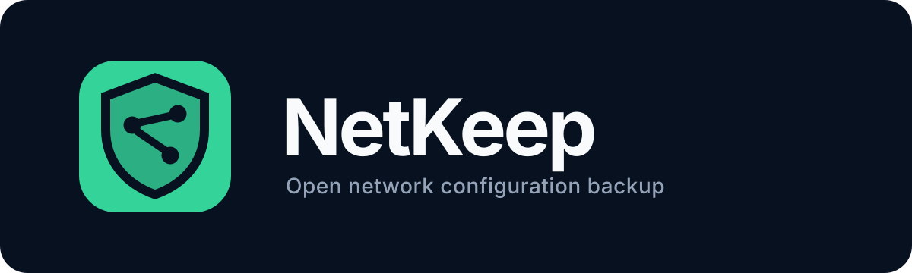
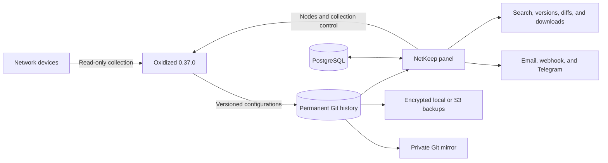

<p align="center">
  
</p>

<p align="center">
  A free, modern control panel for collecting, versioning, comparing, and protecting network device configurations.
</p>

<p align="center">
  <a href="LICENSE"></a>
  <a href="https://github.com/lrqnet/NetKeep/releases/tag/v1.0.1"></a>
  <a href="https://hub.docker.com/r/lrqnet/netkeep"></a>
  <a href="https://github.com/ytti/oxidized"></a>
</p>

NetKeep is designed for Internet service providers and infrastructure teams
that need a safe and approachable way to manage network configuration backups.
It uses [Oxidized 0.37.0](https://github.com/ytti/oxidized) as its unmodified
collection engine and adds inventory, authentication, audit logs, permanent Git
history, notifications, and encrypted redundancy.

> [!IMPORTANT]
> In safe mode, NetKeep collects, compares, and exports configurations without
> applying changes to equipment. This guarantee is conditional on reviewed
> drivers and guided models. Enabling arbitrary Ruby or an unreviewed driver
> explicitly weakens that guarantee.

> [!WARNING]
> Full router, switch, and firewall configurations may contain passwords,
> tokens, SNMP communities, and sensitive network details. Treat the NetKeep
> host and every backup as highly sensitive infrastructure. Use encrypted
> storage, restrict administrative access, and never post real configurations
> or credentials in public issues.

## Highlights

- One-command deployment with Docker Compose and no required `.env` file.
- Laravel 13, PHP 8.4, PostgreSQL, FrankenPHP, React 19, TypeScript, and
  Tailwind CSS 4.
- Oxidized isolated inside the Compose network with no host port exposed.
- NetKeep-controlled persistent collection queue with deduplication, cooldowns,
  bounded retries, global limits, and per-site concurrency.
- Administrative approval of destination, credential, driver, and SSH host key
  before any new device can be collected.
- Devices, sites, groups, tags, vendors, physical models, drivers, and CSV
  import or export.
- Reusable encrypted credential profiles with per-device overrides.
- Permanent Git history, immediate collection, downloads, search, and unified
  or side-by-side diffs.
- Guided models constrained to reviewed read-only commands, plus an isolated
  test engine. Arbitrary Ruby is owner-only and disabled by default.
- Read-only inventory synchronization with LibreNMS and NetBox.
- Email, signed webhook, and Telegram notifications.
- Encrypted full backups to local storage or S3-compatible services and private
  Git mirroring.
- Owner, administrator, operator, and reader roles, with optional TOTP 2FA and
  passkeys.
- English, Brazilian Portuguese, and Latin American Spanish interfaces.
- Multi-architecture images for `linux/amd64` and `linux/arm64`.

## How it works



The NetKeep panel manages inventory, encrypted credentials, schedules, users,
and policies. Oxidized receives nodes through an internal authenticated
endpoint, connects to the equipment, and stores every collected version in
Git. The panel then exposes history and differences without publishing the
Oxidized API or PostgreSQL to the host.

Oxidized's native interval and retries are disabled. NetKeep dispatches one
technical UUID at a time through its persistent queue and enforces the global,
site, retry, and cooldown policy.

## Requirements

- A Linux server using `amd64` or `arm64`.
- Docker Engine 25 or newer.
- Docker Compose plugin 2.24 or newer.
- TCP ports 80 and 443, plus UDP port 443, available on the host.
- Persistent storage sized for the expected configuration history.
- A DNS record pointing to the server when automatic HTTPS is required.

An encrypted host disk or volume and a firewall that limits the panel to
administrative networks are strongly recommended.

## Quick installation

Create a directory, download the Compose file attached to the v1.0.1 release,
and start the stack:

```bash
sudo mkdir -p /opt/netkeep
cd /opt/netkeep
sudo curl -fsSLO https://github.com/lrqnet/NetKeep/releases/download/v1.0.1/compose.yaml
sudo docker compose up -d --wait
sudo docker compose ps
```

Open `http://YOUR-SERVER-IP` in a browser. The first accepted account becomes
the installation owner, but registration requires the ownership token shown
only by this local server command:

```bash
sudo docker compose exec app php artisan netkeep:installation-token
```

The token is invalidated after the owner is created. Public registration is
disabled immediately afterward.

No `.env` file is required. During first startup, NetKeep generates application
and database credentials, encryption keys, and internal tokens in protected,
separated Docker volumes. The web application uses a non-privileged PostgreSQL
role. Migrations, Oxidized configuration, sandbox, and Git repositories are
prepared automatically.

Only ports 80 and 443 are published. PostgreSQL and the Oxidized API remain
available exclusively inside the Docker network.

For detailed production requirements, HTTPS behavior, volume descriptions, and
health checks, read the [installation guide](docs/INSTALL.md).

## First setup

After creating the owner account, the authenticated setup assistant guides you
through:

1. organization name, logo, language, and timezone;
2. canonical HTTPS URL or domain;
3. collection interval and timeout defaults, with live risk warnings;
4. full-backup retention.

When a domain is configured and its DNS points to the server, Caddy obtains and
renews the HTTPS certificate automatically. After setup, safe mode blocks
password and passkey login over HTTP by IP. The IP page remains available for
recovery instructions; insecure login is an owner-only dangerous exception
with a separate five-minute session.

## Basic usage

1. Create an encrypted credential profile under **Credentials**.
2. Review or create the vendor, physical model, and Oxidized driver under
   **Catalog** and **Models**.
3. Add a device with its address, site, group, transport, schedule, and
   credential profile.
4. As an owner or administrator, verify its resolved destination, driver,
   credential, and SSH fingerprint, then approve it.
5. Run the first collection from the device page after reviewing the manual
   collection warning.
6. Open the device configuration history to inspect versions, compare changes,
   search, or download a
   configuration.
7. Configure operational channels under **Notifications**.
8. Configure encrypted backups and private Git mirroring under
   **Data protection**.

NetKeep never deletes historical configurations when a device is disabled or
soft-deleted.

## Operations and security

- Create and verify a complete encrypted backup before every upgrade.
- Never remove Docker volumes during a normal update.
- Keep S3 buckets and Git mirrors private.
- Enable TOTP 2FA or passkeys for privileged accounts.
- Store recovery passwords or key files outside the NetKeep installation.
- Review advanced Ruby models before publishing them; they execute code inside
  the isolated Oxidized container.
- Keep Telnet, arbitrary Ruby, unreviewed drivers, HTTP/IP login, and the WUD
  Docker-socket profile disabled unless the documented risk is accepted.
- Treat short intervals, high timeouts, retries, and high concurrency as load
  on production equipment, not merely panel performance settings.
- Test restoration regularly instead of treating an uploaded backup as proof
  of recoverability.

Follow the dedicated guides for
[upgrades](docs/UPGRADE.md),
[restoration](docs/RESTORE.md),
[administration](docs/ADMINISTRATION.md), and
[architecture](docs/ARCHITECTURE.md).

## Development

The full local stack can be built without using the published image:

```bash
git clone https://github.com/lrqnet/NetKeep.git
cd NetKeep
docker compose -f compose.yaml -f compose.dev.yaml up -d --build --wait
```

The first build may take several minutes while PHP extensions and frontend
assets are compiled. Later builds reuse Docker's cache.

See [development and local testing](docs/DEVELOPMENT.md) for isolated ports,
native development, automated checks, and test commands. Release maintainers
should also read the [image publishing guide](docs/RELEASE.md).

## Support

| Need                                                                                | Channel                                                                                       |
| ----------------------------------------------------------------------------------- | --------------------------------------------------------------------------------------------- |
| Community questions, reproducible bugs, and feature requests without sensitive data | [GitHub Issues](https://github.com/lrqnet/NetKeep/issues)                                     |
| Commercial implementation, migration, or operational support                        | [support-netkeep@lrq.lat](mailto:support-netkeep@lrq.lat)                                     |
| Security vulnerabilities                                                            | [Private GitHub Security Advisory](https://github.com/lrqnet/NetKeep/security/advisories/new) |

Community support is provided on a best-effort basis and has no SLA. Commercial
conditions, availability, and response times are agreed directly by email.
Never send real credentials, device configurations, database dumps, or backup
archives through a public issue.

## Community and license

Contributions are welcome. Read [CONTRIBUTING.md](CONTRIBUTING.md), the
[Code of Conduct](CODE_OF_CONDUCT.md), and the
[Security Policy](SECURITY.md) before opening an issue or pull request.

NetKeep's original code is distributed under the
[GNU Affero General Public License v3.0](LICENSE). Modified installations made
available over a network must provide their corresponding source code. Oxidized
remains licensed under Apache-2.0; its notices are preserved in
[THIRD_PARTY_NOTICES](THIRD_PARTY_NOTICES).

Created and maintained by
[Lucas Quaresma](https://github.com/lrqnet)
([keep@lrq.lat](mailto:keep@lrq.lat)).
